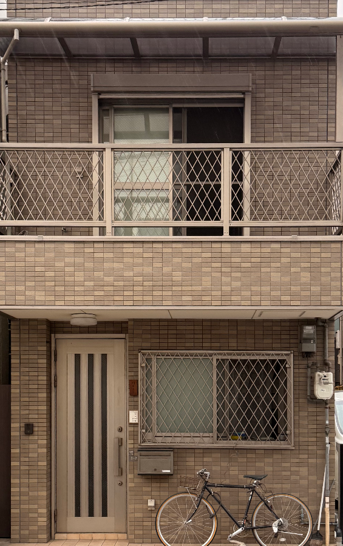
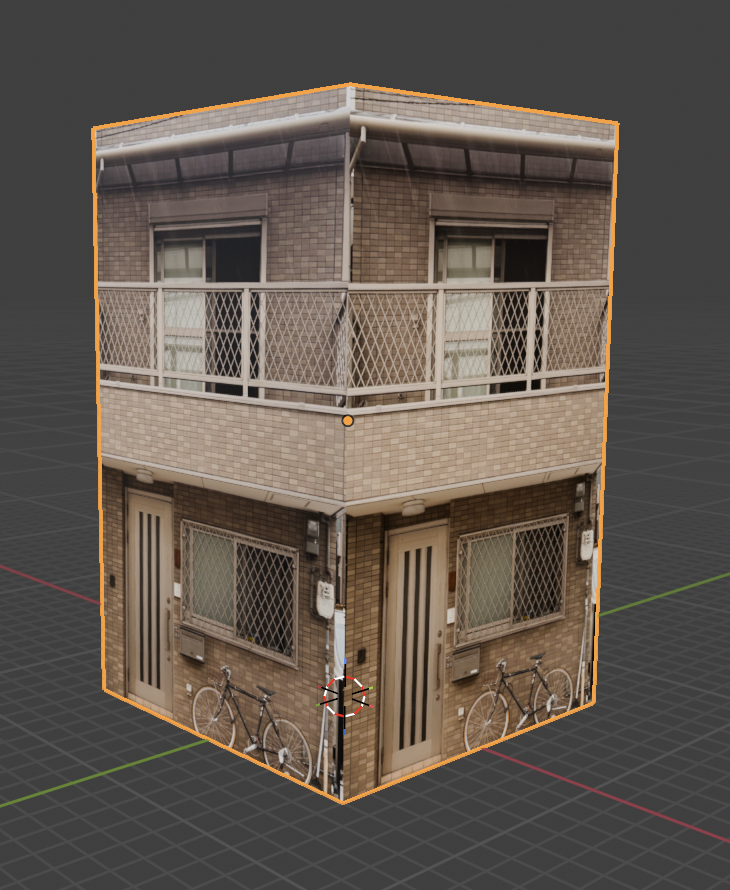

# Building Generator

Transform facade images into 3D Blender buildings with a simple web interface.

## Example

| Original Photo | Rectified | 3D Model in Blender |
|:--------------:|:---------:|:-------------------:|
|  |  |  |

## Features

- Upload any building facade image
- Optional perspective correction for angled photos  
- Automatic 3D building generation with customizable dimensions
- Exports directly to Blender (.blend) files

## Quick Start

### Mac Users
Simply double-click `BuildingGenerator.command` to launch the tool!

### Other Systems
Run in terminal:
```bash
./launch.sh
```

Or manually:
```bash
python3 building_generator_server.py
```

The tool will automatically open in your browser at http://localhost:5555

## Requirements

1. **Python 3** - Usually pre-installed on Mac/Linux
2. **Flask** - Will be installed automatically on first run
3. **Blender** - Download from https://www.blender.org/download/

## How It Works

1. **Upload** - Select a building facade image
2. **Rectify** (Optional) - Fix perspective distortion by clicking 4 corners
3. **Generate** - Set dimensions and create the 3D model
4. The .blend file is saved to your Downloads folder

## Files

- `BuildingGenerator.command` - Mac double-click launcher
- `launch.sh` - Unix/Linux launcher script  
- `building_generator_server.py` - Local web server
- `building-generator.html` - Web interface
- `createBuilding.py` - Blender generation script
- `requirements.txt` - Python dependencies

## Troubleshooting

### "Blender not found"
Click **Settings** in the web interface and select your Blender application.

### "Flask not installed"
Run:
```bash
pip3 install -r requirements.txt
```

### Port 5555 already in use
Edit `building_generator_server.py` and change the port number in the last line.

## License

MIT License - see [LICENSE](LICENSE) for details.